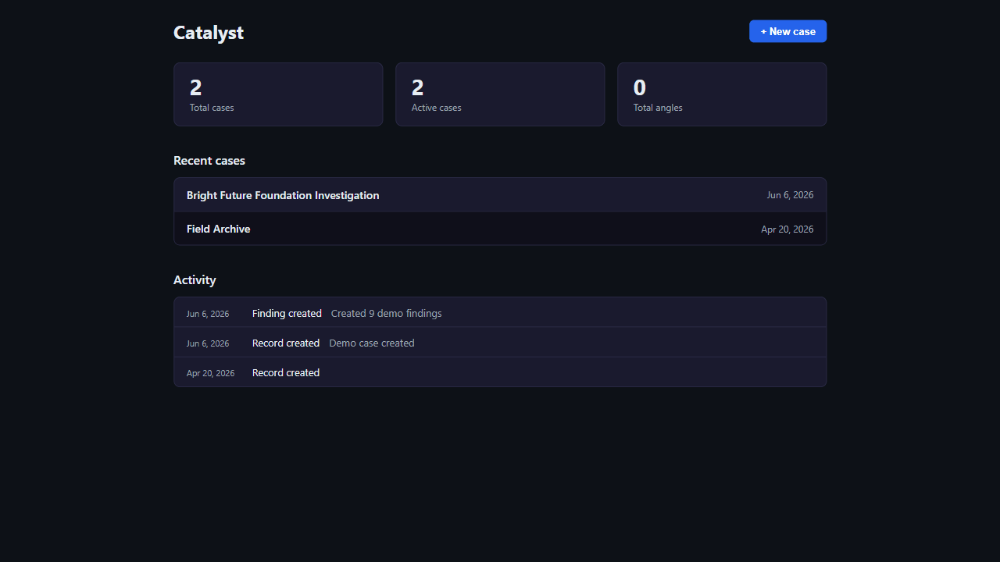

# Catalyst — Referral Packaging for Citizen Investigators


**Catalyst turns scattered public records into a citation-bearing referral package a
professional investigator can act on.** An investigator opens a case, pulls filings from
government sources, uploads documents, and the system resolves the entities, maps how they
connect, runs 17 signal rules over the result, and exports a deterministic PDF where every
sentence traces back to a source document — the deliverable a citizen investigator hands to
an agency with subpoena power (AG / IRS / FBI).

**Why it's non-trivial:** the hard parts aren't the CRUD. They're an append-only evidence
chain with SHA-256 custody, human-in-the-loop entity resolution (no silent merges into an
evidence record), an async job pipeline the UI reattaches to on reload, a graph workflow
built for four levels of drill-down, and a referral gate that refuses to export anything a
human hasn't reviewed and cited.

**▶ Live demo:** https://catalyst-production-9566.up.railway.app/ — a complete investigation
case ("Bright Future Foundation") loads on the homepage. It's a public, read-only demo.



> **What's real vs. demo-seeded.** The connectors, signal rules, entity resolution, async
> pipeline, referral PDF exporter, and the full test suite are real, working code. The demo
> *case* is fictional data seeded to exercise every feature — a deliberate 5 referral-grade /
> 6 need-work mix so the honest middle of an investigation is visible, not an all-green
> highlight reel. Catalyst was built backwards from a real Ohio nonprofit investigation that
> produced referrals to five agencies; identifying details are kept out of this public repo.

---

## Quick start

```bash
cp .env.example .env    # fill in DJANGO_SECRET_KEY and ANTHROPIC_API_KEY
docker compose up -d
docker compose exec backend python manage.py seed_demo
```

Open **http://localhost:5174** — the seeded case loads automatically.

---

## Traceability walkthrough

This is the spine of the product — one clean path from a public record to a citation in the
exported package. It's the path the demo GIF follows:

1. **Research** pulls a real filing (an IRS 990, a county deed) into the case.
2. **Intake** extracts text and entities; entity resolution surfaces fuzzy-match candidates
   for a human to confirm — never a silent merge.
3. On the **Case Map**, the resolved Subjects (people and organizations) render as nodes and
   their Relationships as edges — shared addresses, financial links, and property transfers.
4. Selecting a **Thread** dims the map to just the relationships that thread relies on, so
   you can see the evidence a claim stands on.
5. In the **Thread Builder**, the investigator writes structured assertions and cites each to
   a specific document + page. An assertion's role — fact, analysis, or claim — is *derived
   from its evidence*, not asserted.
6. A thread becomes **referral-grade** only when it's confirmed, cited, weighed as documented
   or traced, and overreach-reviewed. That gate is enforced server-side.
7. **Referrals** exports a deterministic PDF: every finding traces to a cited document, with
   a SHA-256 chain-of-custody appendix. No generated prose reaches the file an agency reads.

---

## What it does

| | |
|---|---|
|  |  |
| **Case Map** — a Cytoscape.js graph of Subjects (people + organizations) and their Relationships. Select a Thread to emphasize the relationships it relies on; drill from the map into a Subject, a Relationship, or the Thread Builder. | **Research** — pull IRS 990 filings, Ohio SOS records, county recorder deeds, Auditor of State findings, and statewide parcels directly into the case. Each search is an async job the UI polls and reattaches to on reload. |
|  |  |
| **Financials** — multi-year 990 data in one view: revenue trend, officer compensation, governance flags. Parsed from IRS TEOS XML via HTTP range requests — no third-party API. | **Referrals** — the deterministic, citation-bearing export. A readiness checklist gates the PDF; every referral-grade thread carries cited assertions and a SHA-256 custody trail. |

---

## Engineering highlights

**1. Append-only evidence chain.** SHA-256 custody on every document, append-only audit
logging on every mutation (`UPDATE`/`DELETE` are blocked at the queryset), immutable
timestamp guards on referral filing dates. Legal defensibility is a primary requirement of
this domain, not a nice-to-have.

**2. Human-in-the-loop entity resolution.** Fuzzy matching surfaces candidates rather than
silent-merging. An investigator must confirm before two records become one — a silent merge
in an evidence chain is worse than an extra click.

**3. A referral gate enforced in one place.** "Referral-grade" is a single predicate
(`referral_grade.py`) reused by the readiness panel, the credibility counts, and the PDF
filter, enforced server-side on the transition into CONFIRMED. It survived a versioned rewrite
(a grandfathering migration froze the old rule inline so a re-run can't corrupt legacy rows).

**4. Async job pipeline with reattach-on-mount.** Research and analysis return `202 + job_id`;
the frontend polls, caps stuck jobs, and re-attaches to in-flight jobs after a reload instead
of orphaning them.

**5. Failure-isolated connectors.** Each government source is its own module with its own
tests. A 404 from one ArcGIS endpoint doesn't take down the IRS pipeline.

**6. AI held to an evidence bar — measured, not promised.** Extraction and pattern analysis
use Claude, but nothing AI-generated ships without human review, and AI findings cap at
`evidence_weight=DIRECTIONAL` until an investigator promotes them. Every AI "Lead" is graded
by a dedicated eval harness: deterministic guards confirm each citation resolves to a real
document and carries no accusatory language, then an **LLM-as-judge** scores *faithfulness*
and *overreach* against golden fixtures — most of them **negative controls** (same-name
strangers, a clean filing) where the correct output is zero leads. The credibility firewall
this product depends on isn't a line in a prompt; it's a property under test.

**7. Built backwards from a real case.** Every signal rule, model field, and UI affordance
traces to an actual pain point from the founding investigation. Nothing here is speculative.

---

## How this is built

AI-first, on purpose. Claude Code writes most of the implementation inside a harness this repo
defines — but *what* ships in a package, *how* evidence is weighed, and *when* an entity merge
is confirmed stay human decisions.

- **`.claude/skills/`**: `new-connector` scaffolds a failure-isolated connector with its tests,
  `smoke-test` runs the live API health check, `session-wrap` closes a session with docs updated.
- **`.github/workflows/`**: Claude reviews every PR alongside CodeRabbit; CI gates the merge.
- **Strict TDD throughout.** The failing test lands before the implementation. 1,100+ backend
  tests and 177 frontend tests hold the line, enforced on every push via a Postgres service
  container — no Railway-roulette.

---

## Tech stack

| Layer | Technology |
|-------|-----------|
| Backend | Django 5.2 · PostgreSQL 16 · Django-Q2 async jobs |
| Frontend | React 18 · TypeScript · Vite · Cytoscape.js · D3 (timeline brush only) |
| AI | Anthropic Claude API (Haiku for intake, Sonnet for pattern analysis) |
| Connectors | IRS TEOS 990 XML · Ohio SOS · Ohio AOS · 88-county Recorder · ODNR Parcels |
| Infrastructure | Railway · Docker · GitHub Actions CI |

---

## How to verify

```bash
# Full backend suite (inside Docker, CI-equivalent):
docker compose exec backend python manage.py test investigations --exclude-tag=eval

# Frontend suite + type check:
cd frontend && npx vitest run && npx tsc --noEmit

# Live API smoke test (local or Railway):
python tests/api_health_check.py
```

The tests that protect the critical workflow specifically: `test_referral_pdf.py` (the export
gate + citation resolution), `test_referral_readiness.py` (the readiness predicate),
`test_signal_rules.py` (all 17 rules), and `test_seed_demo_elements.py` (the canonical
walkthrough path end-to-end).

**AI eval harness** (`investigations/tests/evals/`) grades AI Leads against golden fixtures
(highlight #6). It runs in two lanes: the deterministic guards run inside the suite above; the
non-deterministic **LLM-as-judge** scoring is tagged `@tag("eval")` and excluded from CI so
model calls don't make CI flaky. Run the judged evals on demand:

```bash
docker compose exec backend python manage.py test investigations.tests.evals.test_lead_quality --tag=eval
```

---

## Deeper reference

- **API contract** (exact JSON shapes for every endpoint): [`docs/architecture/api-contract.md`](docs/architecture/api-contract.md)
- **Frontend design spec** (Case Map, drill-down model, tab layouts): [`docs/architecture/frontend-design-spec.md`](docs/architecture/frontend-design-spec.md)
- **Detection & citation methodology** (how the referral gate works): [`docs/METHODOLOGY.md`](docs/METHODOLOGY.md)
- **System map** (architecture, models, pipeline): [`CLAUDE.md`](CLAUDE.md)

---

## Tradeoffs & next steps

- **First 70% is 100%.** The connectors cover Ohio; the architecture generalizes but other
  states aren't wired. Ohio SOS needs a manual CSV upload (the state has no queryable API).
- **The demo is read-only in production** so anonymous visitors can't mutate it; a separate
  write token gates changes.
- **Next:** cross-state connector coverage, and a supported-by graph linking assertions to the
  specific records that back them.

---

## The founding investigation

Catalyst was built from a real public-records investigation into a nonprofit organization,
conducted using only publicly available filings — IRS Form 990s, Secretary of State records,
county recorder filings, audit reports. The investigation produced formal referrals to five
federal and state agencies. Identifying details have been intentionally removed from this
public repository; verification documentation is available on request.

---

**Tyler Collins** · [GitHub](https://github.com/corvus-0x) · [LinkedIn](https://www.linkedin.com/in/tylerjcollins/) · tjcollinsku@gmail.com
