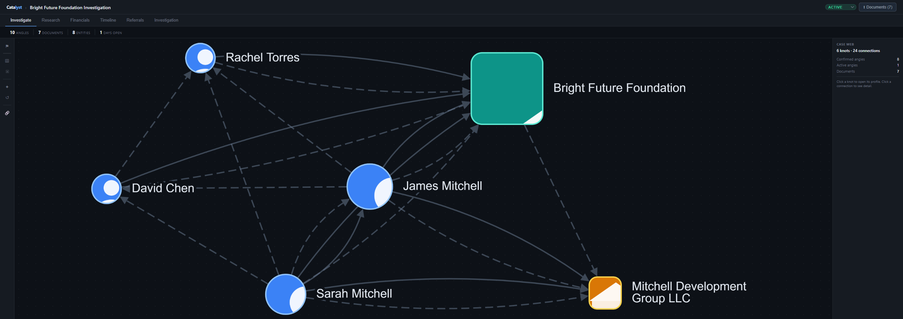
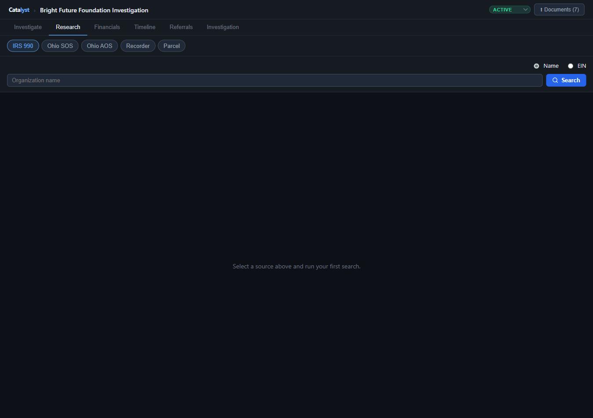
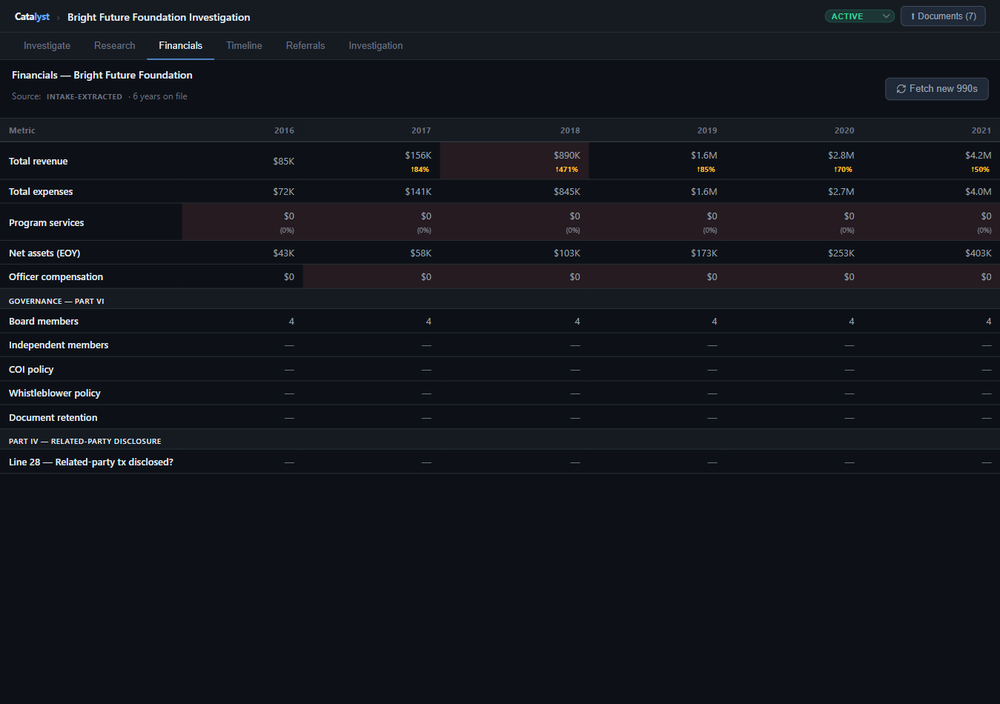
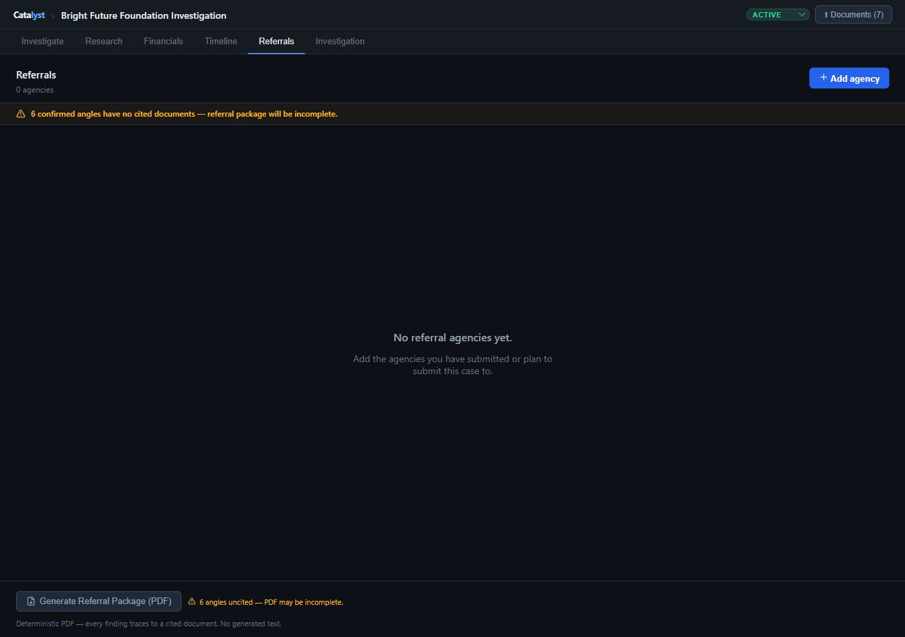

# Catalyst — Intelligence Triage Platform


**Upload public records → Claude extracts entities → 15 fraud-detection rules fire → citation-bearing referral package for the AG / IRS / FBI.**

Built backwards from a real Ohio nonprofit investigation. Five agency referrals filed.

<!-- demo GIF removed pending re-record against the demo workspace -->

---

## Quick start

```bash
cp .env.example .env    # fill in DJANGO_SECRET_KEY and ANTHROPIC_API_KEY
docker compose up -d
docker compose exec backend python manage.py seed_demo
```

Open **http://localhost:5174** — a complete investigation case loads automatically.

---

## What it does

| | |
|---|---|
|  |  |
| **Web** — Cytoscape.js entity graph showing knots (persons + orgs) and connections. Click any node to drill into relationships, financials, and angles. | **Research** — Pull IRS 990 filings, Ohio SOS records, county recorder deeds, AOS findings, and statewide parcels directly into the case. |
|  |  |
| **Financials** — Multi-year 990 data in one view: revenue trends, officer compensation, balance sheet. Parsed from IRS TEOS XML via HTTP range requests — no third-party APIs. | **Referrals** — Deterministic, citation-bearing export. Every sentence traces to a source document. SHA-256 chain of custody on every file. |

---

## How it works

```
Upload PDF → SHA-256 hash → OCR / extract text → Entities resolved
    → 15 signal rules fire → Investigator reviews → AI pattern analysis
        → Citation-bearing referral package
```

The deliverable is a **deterministic referral package** — not an AI summary. AI findings cap at `evidence_weight=DIRECTIONAL`; the investigator promotes them after verification. Generated text never reaches the file an agency reads without explicit human confirmation.

---

## Engineering decisions worth defending in an interview

**1. Audit-first data model.** SHA-256 chain of custody on every document, append-only audit logging on every mutation, immutable timestamp guards on government referral filing dates. Legal defensibility is a primary requirement of this domain, not a nice-to-have.

**2. Human-in-the-loop entity resolution.** Fuzzy matching surfaces candidates rather than silent-merging. An investigator must confirm before two records become one. A silent merge in an evidence chain is worse than an extra click.

**3. AI as a triage aid, not a deliverable.** Claude handles messy document extraction and pattern analysis. The referral package is template-driven and citation-bearing. Nothing AI-generated ships without human review.

**4. Failure-isolated connectors.** Each external source is its own module with its own tests. A 404 from one ArcGIS endpoint does not take down the IRS pipeline.

**5. Backwards from a real case.** Every signal rule, every data model field, every UI affordance traces to an actual pain point from the founding investigation. Nothing here is speculative.

---

## Tech stack

| Layer | Technology |
|-------|-----------|
| Backend | Django 4.2 · PostgreSQL 16 · Django-Q2 async jobs |
| Frontend | React 18 · TypeScript · Vite · Cytoscape.js · D3 (timeline) |
| AI | Anthropic Claude API (Haiku + Sonnet) |
| Connectors | IRS TEOS 990 XML · Ohio SOS · Ohio AOS · 88-county Recorder · ODNR Parcels |
| Infrastructure | Railway · Docker · GitHub Actions CI |

---

## Test surface

921 backend tests covering connectors, API endpoints, all 15 signal rules, async job pipeline, AI pattern augmentation, upload pipeline, entity resolution, classification, and data quality validators. CI enforces the full suite on every push via a Postgres service container — no Railway-roulette.

```bash
# Run the full suite (inside Docker):
docker compose exec backend python manage.py test investigations
```

---

## The founding investigation

This platform was built from a real public-records investigation into a nonprofit organization, conducted using only publicly available filings — IRS Form 990s, Secretary of State records, county recorder filings, audit reports. The investigation produced formal referrals to four federal and state agencies. Identifying details have been intentionally removed from this public repository; verification documentation is available on request.

---

**Tyler Collins** · [GitHub](https://github.com/corvus-0x) · [LinkedIn](https://www.linkedin.com/in/tylerjcollins/) · tjcollinsku@gmail.com
